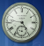

### Documentación.

### Reloj Flex AIR

----



El reloj original es una animación "**Flash**" que forma parte de la colección de ejemplos distribuidos con licencias **Creative Commons Attribution-Noncommercial-Share Alike 3.0 Unported License** y **Creative Commons Plus License for Adobe example code**, desde el:

[Adobe Developer Connection —ActionScript Technology Center — Samples](http://www.adobe.com/devnet/actionscript/samples/time_2.html "Adobe Developer Connection")


Esta es una adaptación para **Adobe AIR** versión 3.1 (o superior) que presenta un "widget" de escritorio, liviano, transparente, móvil y de aspecto personalizado, para los sistemas **Windows** y  **Mac OS X**. Construido (y restaurado) con la herramienta **FlexSDK versión 4.6**.

Pulsando sobre el Reloj con el botón izquierdo del ratón puedes cambiar su posición en la pantalla y con el botón derecho acceder a un menú contextual que permite, entre otras cosas, personalizar su apariencia.

----

#### Adobe®  AIR® (Adobe Integrated Runtime)

**Adobe AIR** (Adobe Integrated Runtime) se concibe como un motor de ejecución versátil que permite código **Flash**, **Actionscript**, **HTML** o **JavaScript** para crear aplicaciones basadas en Internet con muchas características de los programas tradicionales de escritorio. Adobe lo define como un entorno de ejecución que no necesita navegador para traer al escritorio las **RIA** (aplicaciones de Internet enriquecidas).

[Adobe AIR (*Runtime*) - Descarga.](https://get.adobe.com/es/air/ "Adobe AIR")

#### Adobe®  AIR® SDK (Software Development Kit)

**Adobe AIR SDK** y compilador proporciona a los desarrolladores un entorno flexible para la entrega de aplicaciones a través de dispositivos y plataformas (**Windows** , **Mac** , **iOS** , **Android** ).

[Adobe AIR (SDK) - Descargas.](http://www.adobe.com/devnet/air/air-sdk-download.html "Adobe AIR SDK")

#### Adobe® Flex® SDK 

**Adobe Flex** (SDK ) incluye la estructura de **Flex** ( biblioteca de clases de componentes) y el compilador , lo que le permite desarrollar y desplegar aplicaciones **Flex** utilizando el Entorno de Desarrollo Integrado(**IDE**) de tu elección.

[Adobe Flex (SDK) - Descarga.](http://www.adobe.com/devnet/flex/flex-sdk-download.html "Adobe Flex")

#### Documentación para el desarrollo de aplicaciones AIR

**Adobe** proporciona muy buena documentación, extensa y detallada, sobre el desarrollo de aplicaciones **AIR** para escritorio (**Windows y Mac**) o dispositivos móviles (**Android e iOS**).

[Adobe AIR documentation.](http://www.adobe.com/devnet/air/documentation.html "Adobe AIR documentation")

Aquí una estupenda guía teórica, en castellano: [**Creación de aplicaciones de ADOBE AIR.**](http://help.adobe.com/es_ES/air/build/air_buildingapps.pdf "Creación de aplicaciones de ADOBE AIR")  

#### Herramientas necesarias para el desarrollo

* **Java Development Kit (JDK)**. Plataforma **JAVA** estándar, para desarrolladores que puedes obtener en, [http://www.oracle.com/technetwork/java/javase/downloads/](http://www.oracle.com/technetwork/java/javase/downloads/ "JDK").

* **Adobe AIR SDK** o **Adobe Flex SDK** (como en el ejemplo siguiente).    

#### Trabajando con el ejemplo Reloj Flex AIR

Repositorio en **GitHub** : [https://github.com/fooghub/Reloj-Flex-AIR](https://github.com/fooghub/Reloj-Flex-AIR "GitHub Reloj-Flex-AIR")
	
* Descarga el archivo **Reloj-Flex-AIR-master.zip** (pulsando en el botón **DOWNLOAD ZIP**).	

* Extrae los archivos de **Reloj-Flex-AIR-master.zip**  (por ejemplo, en el escritorio).

* Examina el sistema de archivos de la aplicación, en particular el código de **reloj-app.xml** (**descriptor** de propiedades básicas).

**Código fuente**. La carpeta **src** contiene, entre otros:

* El directorio **fla** con el archivo **reloj.fla**, sólo editable con **Adobe Flash Professional** (ahora, **Adobe Animate CC**). Este archivo (fuente) no es el mismo que actualmente proporciona, [Adobe Developer Connection;](http://www.adobe.com/devnet/actionscript/samples/time_2.html "Adobe Developer Connection") es mucho más antiguo (de los tiempos de "Macromedia", adquirida en 2005 por Adobe Systems) y el código **ActionScript** que contiene responde a versiones anteriores a la actual, 3.0. 

	La compilación (con Adobe Flash CS4 Professional, en mi caso) dará lugar a **reloj.swf**. Con un **reloj clásico** y funcional al que se agregaron la posibilidad de mostrar la marca (personalizada) con o sin adorno y el calendario diario (opcionales).
	
		
* El directorio src/**flex** contiene los archivos: .as **ActionScript** (ahora sí, 3.0) y .mxml **Macromedia eXtensible Markup Language**; con la programación (Flex) para el menú de opciones (contextual), las ventanas emergentes y la interacción con Internet.	
	
	Si deseas trabajar con estos archivos, conviene copiarlos y pegarlos en el directorio raíz (para conservar las rutas originales a sus dependencias). Una vez realizadas las modificaciones deseadas, hay que construir un nuevo archivo de contenidos (*index.swf*) compilando el archivo principal **index.mxml**, con la orden en línea de comandos: 

	```
	$ amxmlc -theme=${flexlib}/themes/Halo/halo.swc -- index.mxml
	```

	Este proceso dará lugar a un nuevo archivo principal de contenido: **index.swf**, con el **reloj.swf** y nuestros complementos Flex.

	**Nota:** En el desarrollo de este ejemplo se ha utilizado un PC (*escaso*) con Windows 7 y el conjunto de herramientas, Adobe Flex SDK (versión 4.6). Para mayor comodidad, conviene que la variable del sistema **Path** (Variables de Entorno) disponga de la **ruta** adecuada hasta el directorio **bin** de Adobe Flex SDK.
	
	Los cambios en la marca del reloj, en la vista opcional del calendario diario y del "adorno" se guardan en un simple archivo de *texto plano*, txt/**preferences_101.txt**. Una vez instalada la aplicación, este archivo se mueve hasta el directorio (público) de almacenamiento "**applicationStorageDirectory**"; **único lugar en el que AIR permite las operaciones de lectura y escritura**. La situación física en el equipo de este directorio (*con Windows*) responde a la siguiente ruta:

	```
	C:\Users\[usuario]\AppData[oculto]\Roaming\es.foog.reloj[identificador de la aplicación]\Local Store\preferences_101.txt
	```

**Prueba de la aplicación, depuración de errores**:

Utiliza **AIR Debug Launcher** (ADL) para ejecutar (en modo de prueba) tanto aplicaciones basadas en SWF como las basadas en HTML durante la fase de desarrollo. Con ADL se puede ejecutar (con todas sus funciones operativas) una aplicación sin primero tener que empaquetarla e instalarla. De forma predeterminada, **ADL utiliza un motor de ejecución incluido con el SDK**, con lo cual no se necesita instalar el motor de ejecución por separado para utilizar ADL.

La orden en línea de comandos es:

```
$ adl reloj-app.xml
```

Donde **reloj-app.xml** es el archivo **descriptor de la aplicación**.

**Firma digital de archivos de AIR**:

Todos los archivos (paquetes de instalación) AIR "**app.air**", **deben incluir necesariamente una firma digital que identifica a su editor**.

La **firma digital** se puede producir con un certificado proporcionado por una entidad emisora de certificados (AC) reconocida (opción comercial con coste económico) o con un certificado **no vinculado a ninguna entidad de verificación reconocida<sup> 1 </sup>**; para este último caso, el *kit* AIR ofrece la alternativa de crear un **certificado de firma automática**, (con una validez de cinco años) para nuestras aplicaciones con la herramienta multiusos: **ADT** (AIR Developer Tool) incluida en el SDK (precisa de Java 1.5 o superior).

El formato (mínimo) de la orden, en línea de comandos, para generar un certificado de firma automática, es el siguiente: 

**$ adt -certificate -cn *nombre-del-editor* *tipo-de-clave* *archivo-de-salida* *contraseña***

El ***tipo-de-clave*** que se va a utilizar para el certificado, que puede ser **1024-RSA** o **2048-RSA**.

Por ejemplo:

```
adt -certificate -cn Foog.Software 1024-RSA FoogCert.p12 contraseNNa
```

1. **Nota** : Los paquetes AIR admiten también certificados de firma digital **OpenSSL**.

La orden anterior genera el archivo **FoogCert.p12** (Personal Information Exchange), que utilizaremos en el paso siguiente:


**Distribución, empaquetado de la aplicación**:


Con **ADT** y su opción **-package** podemos construir un paquete de distribución e instalación con nuestro proyecto AIR. La sintaxis del comando, es:

**$ adt -package -storetype pkcs12 -keystore** *[ruta/hasta/archivo/'.p12'] [nombre-del-paquete '.air'] [archivo-descriptor] [archivo-de contenidos] [archivos-o-directorios-auxiliares]*.

En nuestro ejemplo, la orden en línea de comandos será:

```
$ adt -package -storetype pkcs12 -keystore FoogCert.p12 reloj.air reloj-app.xml index.swf doc images src swf txt

```
Incluyendo el código fuente en el directorio **src** y la documentación en **doc** (opcional).

Durante el proceso de compilación **ADT** solicitará la entrada de la **contraseña** del certificado de firma (*contraseNNa*).

La conclusión es **reloj.air**, un paquete funcional e instalable en cualquier equipo **Windows** o **Mac** que disponga de un **Adobe AIR (Runtime)**, apropiado para su sistema operativo.

 **Actualizaciones de la aplicación (vía internet)**:
 
 Consideraciones previas. En este ejemplo, en el archivo *descriptor*, **reloj-app.xml** :

```
<customUpdateUI>true</customUpdateUI>
```
 
 **customUpdateUI**, toma el valor **true** puesto que la aplicación proporciona sus propios cuadros de diálogo para el proceso de actualización. También:
 
```
<allowBrowserInvocation>true</allowBrowserInvocation>
```
  
**allowBrowserInvocation**, toma el valor **true** para  permitir la invocación de la aplicación desde el navegador. Esta opción (el valor por defecto es, false) es **insegura**, ver la documentación **AIR** al respecto. 

Además, la **actualización** funcionará sólo sí:

* La aplicación residente y la actualización tienen el mismo **identificador** (en el archivo **descriptor**):

	```
	<id>es.foog.reloj</id>
	```

* El paquete de **actualización** y la aplicación residentes fueron **firmados** con idéntico **certificado**.

Ahora, en un alojamiento Web, privado, disponemos de una sección con la siguiente estructura:

***http// ... /download/***

&nbsp;&nbsp;&nbsp;&nbsp; ***air/*** 

&nbsp;&nbsp;&nbsp;&nbsp;&nbsp;&nbsp;&nbsp;&nbsp; ***reloj/***

&nbsp;&nbsp;&nbsp;&nbsp;&nbsp;&nbsp;&nbsp;&nbsp;&nbsp;&nbsp;&nbsp;&nbsp;&nbsp;&nbsp;&nbsp;&nbsp; ***updates/***		

&nbsp;&nbsp;&nbsp;&nbsp;&nbsp;&nbsp;&nbsp;&nbsp; ***app/*** &nbsp;&nbsp;&nbsp;&nbsp;&nbsp;&nbsp;&nbsp;&nbsp; **update.xml**(1)

&nbsp;&nbsp;&nbsp;&nbsp;&nbsp;&nbsp;&nbsp;&nbsp; **reloj.air**

**(1) El archivo update.xml** es el **descriptor** del almacenamiento de actualizaciones, debe seguir este esquema **y no otro**:

```xml
<?xml version="1.0" encoding="utf-8"?> 
     <update xmlns="http://ns.adobe.com/air/framework/update/description/2.5"> 
       <versionNumber>1.0.1</versionNumber> <!-- Versión (actualizada) de 'reloj.air'. -->
	   <!-- Ruta absoluta hasta el paquete 'reloj.air', para su descarga y posterior instalación:-->
       <url>http://www.tu-dominio.xxx/download/air/reloj/updates/app/reloj.air</url> 
       <description>
	   <text xml:lang="es">Reloj 1.0.1 : Foog.Software.</text> <!-- nombre de la aplicación, versión y editor -->
	   <text xml:lang="es">Fecha de publicación : 22/01/2016</text> <!-- otras líneas de descripción (opcionales) -->
	   </description> 
    </update>
 ```	
En este proyecto, el código que procura la comunicación con el "repositorio" de actualizaciones se encuentra en el archivo (flex) **index.mxml**. Analizar la función:

```
private function comprobarActualizaciones(repositorioActualizaciones:String):void{
	...;
}	
``` 

Y en el archivo (flex) **VentanaActualizaciones.mxml**, los dialógos y las funciones de interacción para la descarga e instalación de la actualización solicitada.

**Queda por hacer** (*TODO*):

Eliminar automáticamente el contenido del directorio **#ApplicationUpdater**, con **Windows** en la ruta,

```
C:\Users\[usuario]\AppData\Roaming\es.foog.reloj[id de la aplicación]\Local Store\#ApplicationUpdater\
```

que contiene ahora los archivos **residuales** utilizados en el proceso de actualización.


**Reloj (versión 0.0.1):**

Desde [**este enlace**](http://www.foog.es/download/air/reloj/installer/app/reloj.air "reloj.air 0.0.1"), puedes descargar e instalar una primera versión de la aplicación para observar su aspecto y, si te gusta, actualizarla para comprobar los (pocos) cambios realizados.

Saludos.

----
Foog.Software

[www.foog.es](http://www.foog.es/)
 

